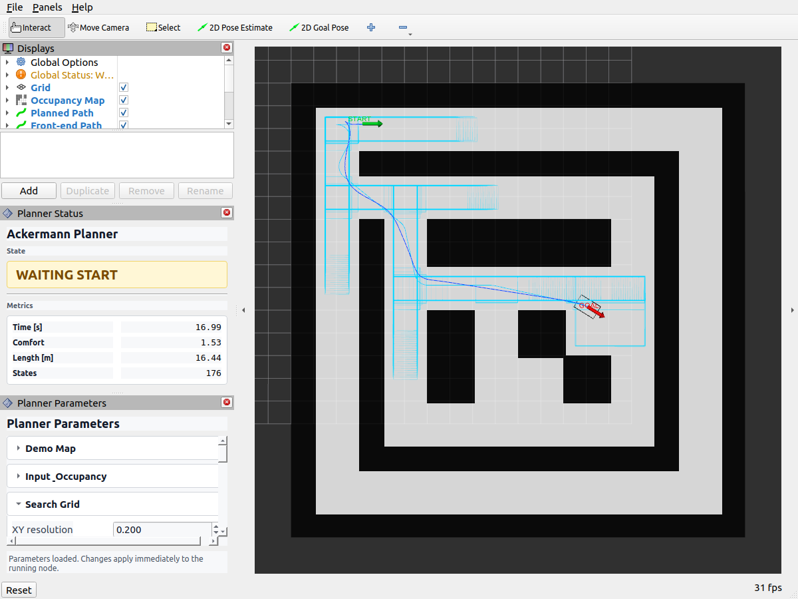

# Ackermann Hybrid A* Planner with Safe-Corridor Optimization

> A ROS2 Humble trajectory planning package for bidirectional Ackermann vehicles, integrating a C++ Hybrid A* front-end, safe-corridor generation, and a Python CasADi/IPOPT nonlinear optimization back-end.
>
> System environment: Ubuntu 22.04 + ROS2 Humble

---

### Core Features

  * A C++ bidirectional Ackermann Hybrid A* front-end using the state representation `(x, y, yaw)`.
  * Forward and reverse Ackermann motion primitive sampling with configurable steering, reverse, steering-change, and direction-change costs.
  * Terminal analytic expansion through OMPL Reeds-Shepp connection.
  * A two-circle vehicle collision model shared by front-end collision checking and back-end safe-corridor construction.
  * Safe-corridor construction with fast/fine polling expansion and optional world-axis-aligned corridor frames.
  * A Python CasADi/IPOPT back-end for trajectory time and comfort optimization under kinematic and corridor constraints.
  * RViz integration for map display, start/goal selection, front-end and optimized path visualization, moving vehicle footprint playback, safe-corridor display, planner status, and online parameter tuning.

---

### Prerequisites

> The planner package has been developed and tested in ROS2 Humble. If a conda environment is active, use the system Python for `colcon build` and keep the conda Python path only for the CasADi runtime back-end.

```bash
sudo apt install ros-humble-rviz2
sudo apt install ros-humble-ompl
sudo apt install python3-colcon-common-extensions
```

The CasADi back-end requires a Python environment with `casadi` and IPOPT support. The default configuration uses:

```text
/home/balmung/miniconda3/bin/python3
```

If your CasADi environment is elsewhere, modify `backend_casadi_python` in `config/planner.yaml` or through the RViz parameter panel. Also check `backend_casadi_script`: it should point to the actual `scripts/casadi_backend.py` path in your workspace, especially after moving or cloning the package.

---

### Package Overview

  * `fourwis_planner_core` The C++ planning core, including the Ackermann Hybrid A* search, occupancy-grid handling, Reeds-Shepp analytic expansion, collision checking, and safe-corridor optimizer interface.

  * `fourwis_planner_cpp` The ROS2 planner node. It subscribes to `/map`, `/initialpose`, and `/goal_pose`, then publishes the front-end path, optimized trajectory, status, metrics, and visualization markers.

  * `fourwis_demo_map_cpp` A lightweight built-in map publisher used for quick tests and RViz demonstrations.

  * `status_panel` Two RViz panels: one for planner state and metrics, and one for online parameter tuning.



---

### Usage

```bash
# 1. Build the package with the system Python used by ROS2
cd /home/balmung/Legacy/4WIS_Global
colcon build --packages-select fourwis_hybrid_astar_cpp --cmake-args -DPython3_EXECUTABLE=/usr/bin/python3
source install/setup.bash

# 2. Before running, check the CasADi Python interpreter and script path in config/planner.yaml
#    backend_casadi_python: Python executable with casadi installed
#    backend_casadi_script: absolute path to scripts/casadi_backend.py

# 3. Launch the demo map, planner, and RViz
ros2 launch fourwis_hybrid_astar_cpp planner.launch.py
```

In RViz:

  * Use `2D Pose Estimate` to publish the start pose on `/initialpose`.
  * Use `2D Goal Pose` to publish the goal pose on `/goal_pose`.
  * The map is shown through `/map`.
  * The raw front-end path is shown through `/fourwis_frontend_path`.
  * The optimized final path is shown through `/fourwis_path` and `/fourwis_path_markers`.
  * Start and goal arrows are shown through `/fourwis_pose_markers`.
  * Safe-corridor wireframes are shown through `/fourwis_corridor_markers`.
  * The moving vehicle body marker is shown through `/fourwis_body_markers` when enabled.

The launch file also supports common overrides:

```bash
# Launch without RViz
ros2 launch fourwis_hybrid_astar_cpp planner.launch.py use_rviz:=false

# Launch with an external parameter file
ros2 launch fourwis_hybrid_astar_cpp planner.launch.py config_file:=/path/to/planner.yaml

# Launch without the built-in map publisher
ros2 launch fourwis_hybrid_astar_cpp planner.launch.py use_demo_map:=false
```

---

### Planning Interfaces

#### 1. Input Topics

  * Occupancy grid map

        /map

    * Type: `nav_msgs/OccupancyGrid`
    * QoS: transient local, reliable

  * Start pose

        /initialpose

    * Type: `geometry_msgs/PoseWithCovarianceStamped`
    * Recommended RViz tool: `2D Pose Estimate`

  * Goal pose

        /goal_pose

    * Type: `geometry_msgs/PoseStamped`
    * Recommended RViz tool: `2D Goal Pose`

#### 2. Output Topics

  * Optimized final trajectory

        /fourwis_path

    * Type: `nav_msgs/Path`

  * Front-end trajectory before back-end optimization

        /fourwis_frontend_path

    * Type: `nav_msgs/Path`

  * Planner state and metrics

        /fourwis_planner_state
        /fourwis_metrics_text
        /fourwis_planner_status

    * Type: `std_msgs/String`

  * RViz marker arrays

        /fourwis_path_markers
        /fourwis_pose_markers
        /fourwis_corridor_markers
        /fourwis_body_markers

    * Type: `visualization_msgs/MarkerArray`

---

### Parameter Configuration

All runtime parameters are stored in [config/planner.yaml](config/planner.yaml).

Detailed parameter meanings and units are documented in [docs/parameters.md](docs/parameters.md).

The RViz `Planner Parameters` panel exposes the same parameters in collapsible groups. Parameter edits are sent through ROS2 parameter services and take effect on the next planning request. Visualization-related parameters take effect on the next marker publication.

Important parameter groups:

  * `Search Grid`: front-end discretization and maximum search iterations.
  * `Goal & Analytic`: goal tolerances and OMPL Reeds-Shepp terminal connection trigger distance.
  * `Vehicle Geometry`: wheelbase, vehicle size, and collision clearance.
  * `Vehicle Limits`: reference velocity and maximum steering angle.
  * `Front-End Costs`: reverse, steering, steering-change, and direction-change penalties.
  * `Backend Solver`: CasADi script path and IPOPT iteration settings.
  * `Backend Corridor`: back-end resampling and safe-corridor expansion settings.
  * `Backend Objective & Bounds`: comfort weight, soft-constraint penalty, velocity bound, and acceleration bound.
  * `Visualization`: pose arrows, safe-corridor display, and moving body playback.

Built-in map scenarios can be switched online with `map_scenario`:

```text
legacy_maze
legacy_maze_inflated_0_1
legacy_parking
reference_parking
tight_complex
```

---

### Acknowledgement

Part of the code refactoring and documentation polishing in this repository was assisted by OpenAI Codex. The final implementation, parameter choices, and experimental use should still be reviewed and validated by the user.

---

<details>
<summary>点击查看中文版</summary>

## 基于安全走廊优化的 Ackermann Hybrid A* 规划器

> 面向双向 Ackermann 车辆的 ROS2 Humble 轨迹规划功能包，集成 C++ Hybrid A* 前端、安全走廊生成，以及 Python CasADi/IPOPT 非线性优化后端。
>
> 系统环境：Ubuntu 22.04 + ROS2 Humble

---

### 基本功能

  * 基于 C++ 实现的双向 Ackermann Hybrid A* 前端，状态表示为 `(x, y, yaw)`。
  * 支持前进与后退 Ackermann 运动 primitive 采样，并可配置倒车、转角、转角变化和换向代价。
  * 支持 OMPL Reeds-Shepp 曲线作为终端解析连接。
  * 前端碰撞检测与后端安全走廊共用双圆车辆模型。
  * 安全走廊支持快慢分步轮询扩展，并可选择世界坐标轴对齐走廊。
  * 使用 Python CasADi/IPOPT 后端，在运动学约束与安全走廊约束下优化轨迹时间和舒适度。
  * 集成 RViz：地图显示、起终点选择、前端与后端轨迹显示、车体框动态播放、安全走廊显示、规划状态显示和在线参数调整。

---

### 必要前置

> 本功能包基于 ROS2 Humble 开发与测试。如果当前终端启用了 conda 环境，建议编译时使用系统 Python；CasADi 后端运行时仍可使用 conda Python。

```bash
sudo apt install ros-humble-rviz2
sudo apt install ros-humble-ompl
sudo apt install python3-colcon-common-extensions
```

CasADi 后端需要 Python 环境中安装 `casadi` 并具备 IPOPT 支持。默认配置使用：

```text
/home/balmung/miniconda3/bin/python3
```

如果你的 CasADi 环境路径不同，可修改 `config/planner.yaml` 中的 `backend_casadi_python`，也可以在 RViz 参数面板中在线修改。同时请检查 `backend_casadi_script`，它需要指向当前工作空间中真实存在的 `scripts/casadi_backend.py` 绝对路径，移动或重新克隆项目后尤其要注意。

---

### 功能包说明

  * `fourwis_planner_core` C++ 规划核心，包含 Ackermann Hybrid A* 搜索、栅格地图处理、Reeds-Shepp 解析连接、碰撞检测和安全走廊优化接口。

  * `fourwis_planner_cpp` ROS2 规划节点。订阅 `/map`、`/initialpose` 和 `/goal_pose`，发布前端路径、优化后轨迹、状态、指标和 RViz 可视化 marker。

  * `fourwis_demo_map_cpp` 内置地图发布节点，用于快速测试和 RViz 演示。

  * `status_panel` RViz 侧边面板插件，包括规划状态/指标面板和在线参数调整面板。


---

### 使用说明

```bash
# 1. 使用 ROS2 系统 Python 编译功能包
cd /home/balmung/Legacy/4WIS_Global
colcon build --packages-select fourwis_hybrid_astar_cpp --cmake-args -DPython3_EXECUTABLE=/usr/bin/python3
source install/setup.bash

# 2. 运行前检查 config/planner.yaml 中的 CasADi Python 解释器和脚本路径
#    backend_casadi_python: 安装了 casadi 的 Python 可执行文件
#    backend_casadi_script: scripts/casadi_backend.py 的绝对路径

# 3. 启动内置地图、规划器和 RViz
ros2 launch fourwis_hybrid_astar_cpp planner.launch.py
```

在 RViz 中：

  * 使用 `2D Pose Estimate` 在 `/initialpose` 发布起点。
  * 使用 `2D Goal Pose` 在 `/goal_pose` 发布终点。
  * `/map` 显示地图。
  * `/fourwis_frontend_path` 显示后端优化前的前端路径。
  * `/fourwis_path` 与 `/fourwis_path_markers` 显示优化后的最终轨迹。
  * `/fourwis_pose_markers` 显示起点和终点箭头。
  * `/fourwis_corridor_markers` 显示后端安全走廊线框。
  * `/fourwis_body_markers` 在启用后显示沿最终轨迹运动的单个车体框。

launch 文件支持常用参数覆盖：

```bash
# 不启动 RViz
ros2 launch fourwis_hybrid_astar_cpp planner.launch.py use_rviz:=false

# 使用外部参数文件
ros2 launch fourwis_hybrid_astar_cpp planner.launch.py config_file:=/path/to/planner.yaml

# 不启动内置地图发布节点
ros2 launch fourwis_hybrid_astar_cpp planner.launch.py use_demo_map:=false
```

---

### 规划接口说明

#### 1. 输入话题

  * 栅格地图

        /map

    * 类型：`nav_msgs/OccupancyGrid`
    * QoS：transient local，reliable

  * 起点位姿

        /initialpose

    * 类型：`geometry_msgs/PoseWithCovarianceStamped`
    * 推荐 RViz 工具：`2D Pose Estimate`

  * 终点位姿

        /goal_pose

    * 类型：`geometry_msgs/PoseStamped`
    * 推荐 RViz 工具：`2D Goal Pose`

#### 2. 输出话题

  * 优化后的最终轨迹

        /fourwis_path

    * 类型：`nav_msgs/Path`

  * 后端优化前的前端轨迹

        /fourwis_frontend_path

    * 类型：`nav_msgs/Path`

  * 规划状态与指标

        /fourwis_planner_state
        /fourwis_metrics_text
        /fourwis_planner_status

    * 类型：`std_msgs/String`

  * RViz 可视化 marker

        /fourwis_path_markers
        /fourwis_pose_markers
        /fourwis_corridor_markers
        /fourwis_body_markers

    * 类型：`visualization_msgs/MarkerArray`

---

### 参数调整

所有运行参数位于 [config/planner.yaml](config/planner.yaml)。

详细参数含义和单位见 [docs/parameters.md](docs/parameters.md)。

RViz 中的 `Planner Parameters` 面板提供相同参数的折叠式在线调整界面。参数通过 ROS2 parameter service 发送到正在运行的节点；规划参数会在下一次规划请求中生效，可视化参数会在下一次 marker 发布时生效。

主要参数分组包括：

  * `Search Grid`：前端离散分辨率和最大搜索迭代次数。
  * `Goal & Analytic`：终点容差和 OMPL Reeds-Shepp 终端连接触发距离。
  * `Vehicle Geometry`：轴距、车体尺寸和碰撞安全裕度。
  * `Vehicle Limits`：参考速度和最大转角。
  * `Front-End Costs`：倒车、转角、转角变化和换向代价。
  * `Backend Solver`：CasADi 脚本路径和 IPOPT 迭代设置。
  * `Backend Corridor`：后端重采样和安全走廊扩展设置。
  * `Backend Objective & Bounds`：舒适度权重、软约束惩罚、速度边界和加速度边界。
  * `Visualization`：起终点箭头、安全走廊显示和车体框播放。

内置地图场景可通过 `map_scenario` 在线切换：

```text
legacy_maze
legacy_maze_inflated_0_1
legacy_parking
reference_parking
tight_complex
```

---

### 声明

本仓库中的部分代码重构与文档整理受到了 OpenAI Codex 的辅助。最终实现、参数选择和实验使用仍应由使用者进行检查与验证。

</details>
